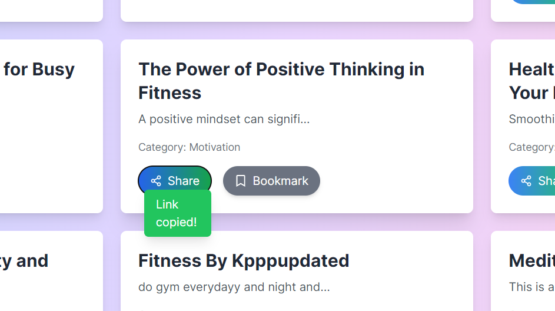
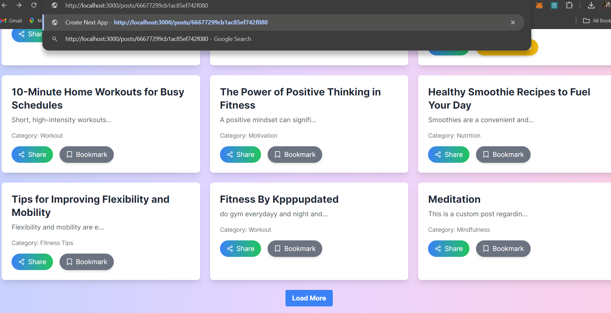
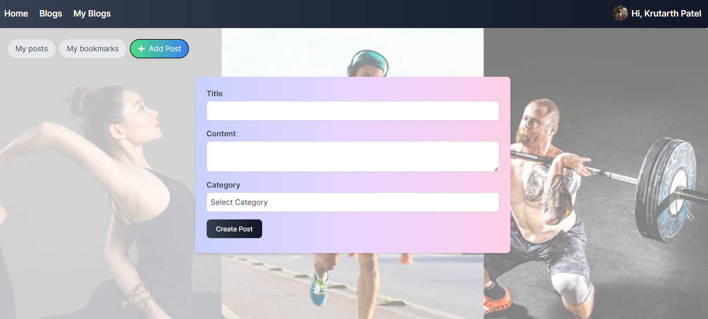
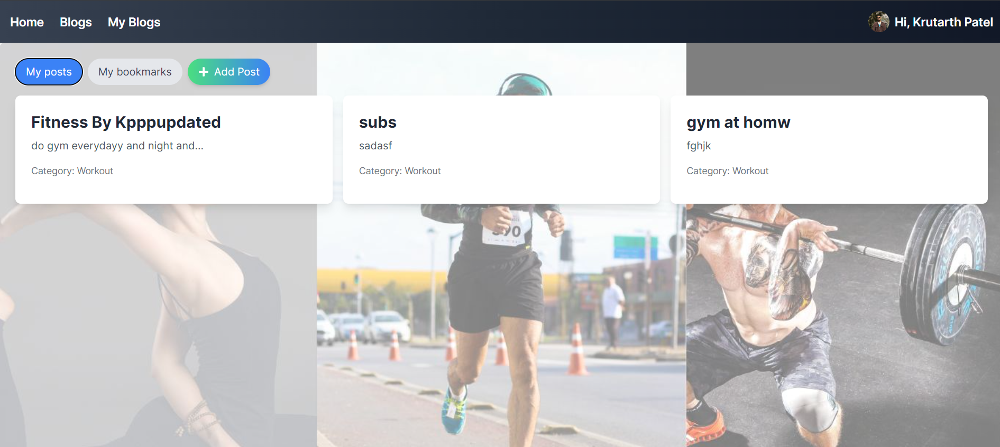
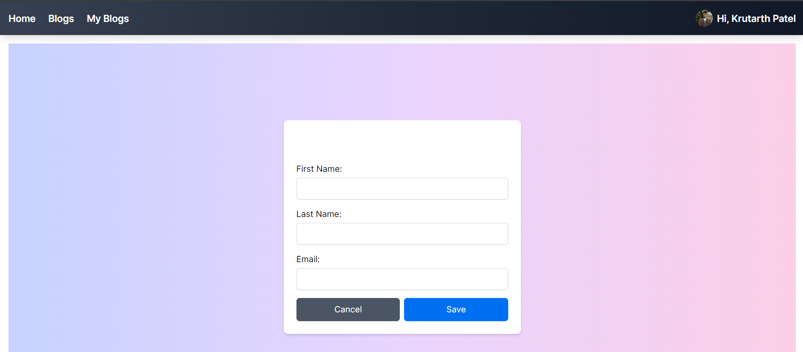
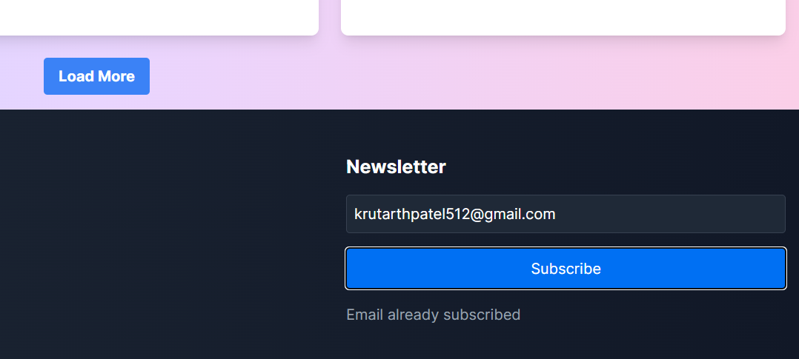

Fitness Blog is an online portal to create posts related to fitness

Default page(without user profile) list all the posts under different categories related to fitness.
Logged in users will have the option to create/edit post, save(bookmark) post

Functionalities include

* Posts page list the preview of posts
* Detailed view page show the full content
* User account authentication using Google Auth
* Logged-in users can create/edit post,bookmark the posts to view later
* Search posts by text and Category

# Project Tech Stack

- NextJS
- TypeScript
- MongoDB

# Product URL

Deployed link in vercel - 

# Contributions

## Subramanian Noorani Gopalakrishnan
- Post listing page with post preview component
- Search bar component and backend
- CRUD APIs for posts
- Bookmark backend functionality and APIs
- Load bookmarked posts for user

## Anoop Anil Kumar
 - Header,footer,myposts component
 - CRUP APIs for latest posts,categories and users
 - Authentication and user creation
 - CRUP API for post fetching based on user
 - Create/edit post screen and functionality
 - My blogs page including search by 'my posts'

## Krutarth Patel
- Share functionality.
    
- Detailed Post functionality  

- Styled all pages for a consistent and professional look.
  
- Resolved various bugs to improve functionality and user experience.
- Developed an edit profile page, later scrapped.

## Abhik Patel 
- Created login signup page(later scraped because we used nextauth)
- Styled all pages for good user experience.
 
- Created and styled bookmark and share components (UI)

- Added option to subscribe and redesigned footer component.(worked on storing emails of subscribers)
